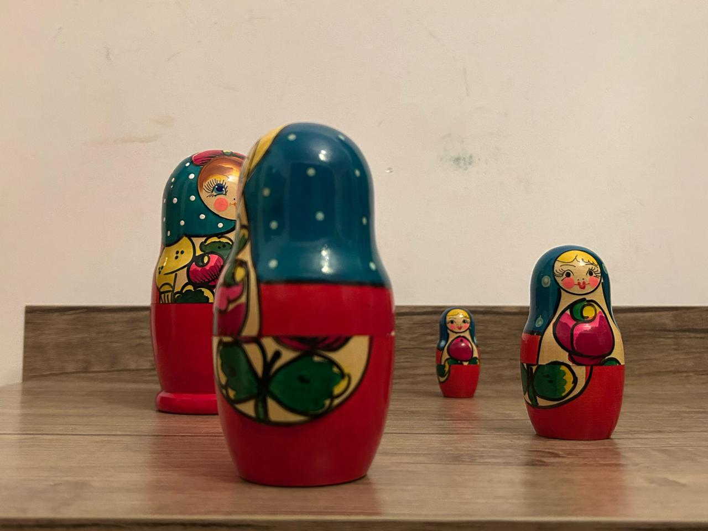
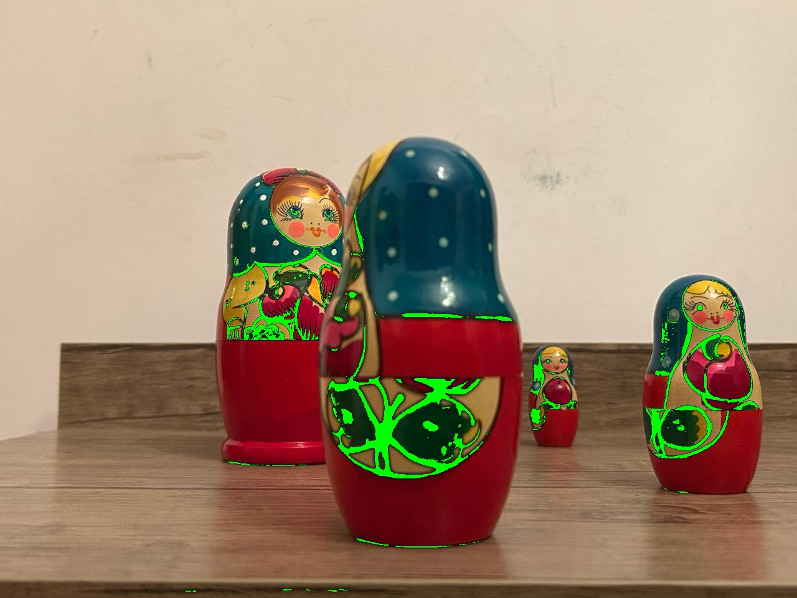

# Image Grayscale Conversion and Display Tool

digital_images.ipynb script provides functionalities to convert color images to grayscale using two different methods and display them side by side for comparison. It utilizes the Python Imaging Library (PIL) and NumPy to process images, employing the NTSC method for perceptually weighted grayscale conversion and a simple average method for a straightforward grayscale conversion.

## Features

- **NTSC Grayscale Conversion**: Converts color images to grayscale based on the NTSC (National Television System Committee) standard. This method applies a weighted sum of the RGB values to better reflect human perception. The grayscale value is calculated as follows:

  ```plaintext
  gray = 0.299 * R + 0.587 * G + 0.114 * B

- **Average Grayscale Conversion**: Converts color images to grayscale by averaging the RGB values.

## Installation

To use this script, you will need Python installed on your system along with the PIL (Pillow) and NumPy packages. If you haven't installed these packages yet, you can install them using pip:

```bash
pip install Pillow numpy


# Color Picker and Highlighter Documentation

This project encompasses a Python script designed to facilitate the selection of a specific color from a given image, and to subsequently highlight regions within that image which closely match the chosen color, adjustable by a user-defined threshold. This document aims to delineate the procedure required to effectively operate the script.

## Prerequisites

Before running the script, ensure you have Python installed on your system along with the necessary Python libraries. You can install the required libraries using the following command:

```bash
pip install -r requirements.txt
```

## Installation

### Clone the Repository

Initiate by cloning this repository to your local device utilizing Git. Execute the ensuing command within a terminal interface:

```bash
git clone https://github.com/ADA-GWU/a2-digital-image-and-color-spaces-tmehtiyev2019.git
```

### Navigate to the Project Directory

Transition into the project directory with the command:

```bash
cd a2-digital-image-and-color-spaces-tmehtiyev2019
```


## Running the Script

To operationalize the script, an image file must be situated within the project directory or be accessible through a specified path. The script accepts two parameters:

- `image_path`: The path directing to the image file.
- `--threshold` (optional): The threshold for color similarity, defaulting to 50 if unspecified.

Employ the following command to execute the script:

```bash
python main.py <image_path> --threshold <value>
```


Replace `<image_path>` with the path to your image file, and `<value>` with the preferred threshold value for color similarity. For instance:


```bash
python main.py photos/matryoshka.jpeg --threshold 50
```

## Usage Example

After running the script with the specified command, a window will display the chosen image. Click on any part of the image to pick a color. The script will then highlight areas within the image that are of a similar color to the one picked.

For example, in the following case, the color `xxx` was picked from the image `x.jpeg` with a threshold of 30. The input image and its corresponding output are shown below:

### Input Image:


### Output Image:


Explanation: The output image highlights areas within the input image that closely match the color `[12, 17, 18]` (black lines in the objects), with a threshold of 20.


