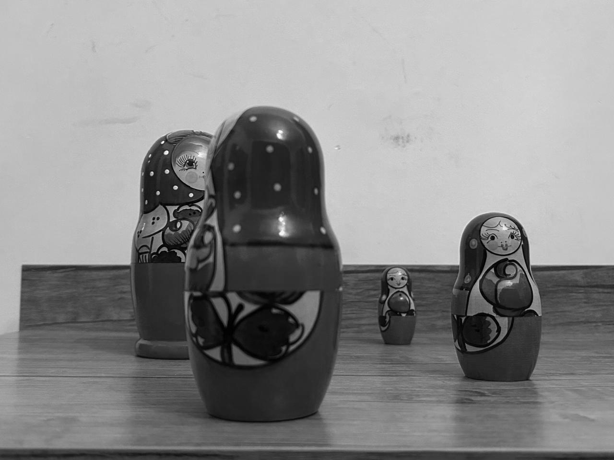
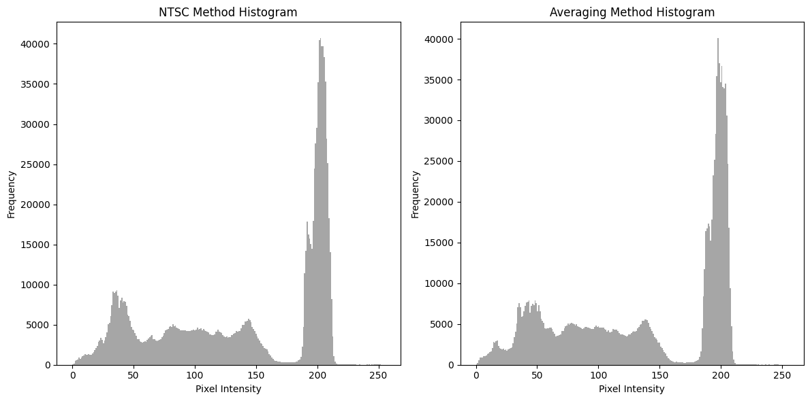
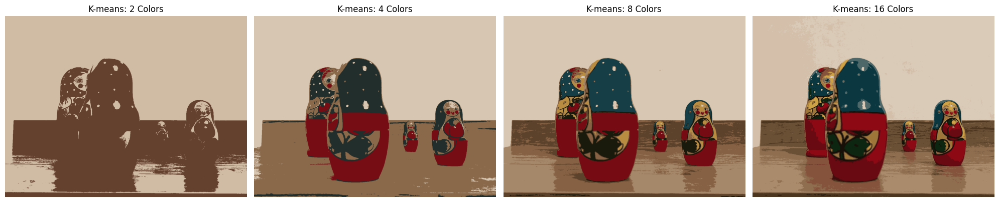
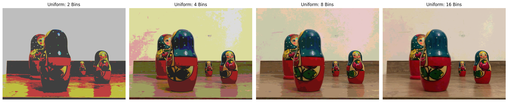
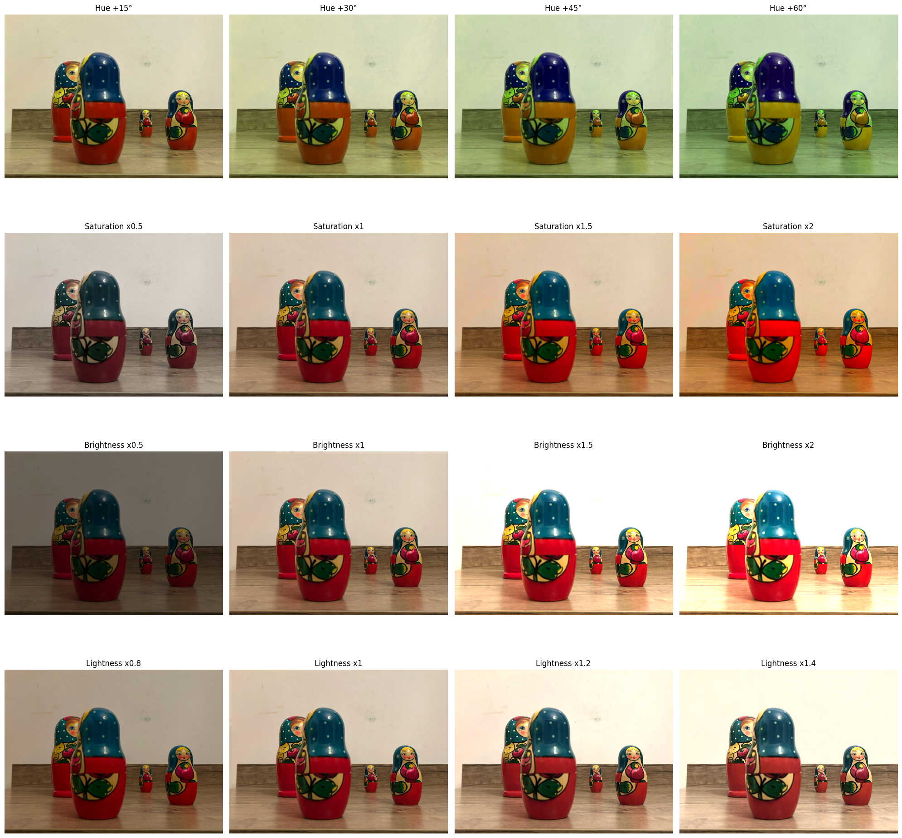

# Image Grayscale Conversion

`digital_images.ipynb` script provides functionalities to convert color images to grayscale using two different methods and display them side by side for comparison. It utilizes the Python Imaging Library (PIL) and NumPy to process images, employing the NTSC method for perceptually weighted grayscale conversion and a simple average method for a straightforward grayscale conversion.

## Features

- **NTSC Grayscale Conversion**: Converts color images to grayscale based on the NTSC (National Television System Committee) standard. This method applies a weighted sum of the RGB values to better reflect human perception. The grayscale value is calculated as follows:

  ```
  gray = 0.299 * R + 0.587 * G + 0.114 * B
  ```


  

- **Average Grayscale Conversion**: Converts color images to grayscale by averaging the RGB values.




###  Quantitative Comparison:

- NTSC Method: Mean = 140.1889200846354, Standard Deviation = 66.67641647138772
- Averaging Method: Mean = 137.16956217447915, Standard Deviation = 65.0926175487364




### Qualitative Comparison:

- **NTSC Method**: This method applies different weights to the RGB components based on human perception sensitivity. Humans are more sensitive to green light, so the green component has a higher weight. The resulting grayscale image often appears more balanced and true to the perceived brightness of the original color image.

- **Averaging Method (Equal Weights)**: By giving each RGB component the same weight (1/3 each), this method treats all colors equally. This approach might not always align with human visual perception, potentially leading to a grayscale image that feels less dynamically balanced compared to the NTSC method.


# Color Quantization Algorithms

### Color Quantization Algorithms on the Images:

#### Used Algorithms: K-means, Uniform Quantization

- **K-means Quantization**: This algorithm partitions the image's color space into \(K\) clusters, where \(K\) is a predefined number of colors to be used in the quantized image. It iteratively refines the position of centroids (the average of the colors in a cluster) and reassigns pixels to the closest centroid, minimizing the distance between pixels and centroids. This method is effective for reducing the number of colors while maintaining the perceptual quality of the image.

- **Uniform Quantization**: Unlike K-means, Uniform Quantization simplifies the color space by uniformly dividing it into bins across each color dimension (RGB). Each color in the original image is then mapped to the closest color in this simplified palette. This method is computationally less intensive but might not preserve the image's visual quality as effectively as K-means, especially with a low number of colors.

`digital_images.ipynb` file describes the details of implementation.

#### Outputs






# Comparison of Hue, Saturation, Brightness, and Lightness Adjustments

## Hue

- **Definition**: Hue represents the color itself, the aspect of color which is described by names like red, green, blue, etc.
- **Impact**: Adjusting the hue changes the base color (or wavelength) of the image pixels without altering the brightness or saturation. This can shift the entire color spectrum of the image, leading to a visually different color appearance.

## Saturation

- **Definition**: Saturation measures the intensity or purity of a color. It represents how far a color is from a gray of the same brightness, ranging from fully saturated (pure color) to completely desaturated (gray).
- **Impact**: Adjusting saturation enhances or dulls the colors in an image. Increasing saturation will make colors more vivid, whereas decreasing it will make them closer to gray.

## Brightness

- **Definition**: Brightness refers to the perception of how intense light is. In color models like HSV/HSB, it represents the intensity of the light that a color reflects or emits.
- **Impact**: Brightness adjustments make the image appear lighter or darker. It affects all pixels and can change the overall impression of illumination within the image, without changing the color (hue) or purity (saturation).

## Lightness

- **Definition**: Lightness, in color science, is a measure of the perceived brightness of a color relative to a similarly illuminated white. It's a concept used in HSL and Lab color models to represent a midpoint between the darkest and lightest extremes of color.
- **Impact**: Adjusting lightness affects the perceived illumination of the color, making it appear closer to white or black. This adjustment is designed to maintain the color's hue and saturation while altering how light or dark the color appears.


For further details on the implementation of hue, saturation, brightness, and lightness adjustments, please refer to the  `digital_images.ipynb` file.




# Color Picker and Highlighter Documentation

This project encompasses a Python script designed to facilitate the selection of a specific color from a given image, and to subsequently highlight regions within that image which closely match the chosen color, adjustable by a user-defined threshold. This document aims to delineate the procedure required to effectively operate the script.

## Prerequisites

Before running the script, ensure you have Python installed on your system along with the necessary Python libraries. You can install the required libraries using the following command:

```bash
pip install -r requirements.txt
```

## Installation

### Clone the Repository

Initiate by cloning this repository to your local device utilizing Git. Execute the ensuing command within a terminal interface:

```bash
git clone https://github.com/ADA-GWU/a2-digital-image-and-color-spaces-tmehtiyev2019.git
```

### Navigate to the Project Directory

Transition into the project directory with the command:

```bash
cd a2-digital-image-and-color-spaces-tmehtiyev2019
```


## Running the Script

To operationalize the script, an image file must be situated within the project directory or be accessible through a specified path. The script accepts two parameters:

- `image_path`: The path directing to the image file.
- `--threshold` (optional): The threshold for color similarity, defaulting to 50 if unspecified.

Employ the following command to execute the script:

```bash
python main.py <image_path> --threshold <value>
```


Replace `<image_path>` with the path to your image file, and `<value>` with the preferred threshold value for color similarity. For instance:


```bash
python main.py photos/matryoshka.jpeg --threshold 50
```

## Usage Example

After running the script with the specified command, a window will display the chosen image. Click on any part of the image to pick a color. The script will then highlight areas within the image that are of a similar color to the one picked.

For example, in the following case, the color `xxx` was picked from the image `x.jpeg` with a threshold of 30. The input image and its corresponding output are shown below:

### Input Image:


### Output Image:


Explanation: The output image highlights areas within the input image that closely match the color `[12, 17, 18]` (black lines in the objects), with a threshold of 20.


